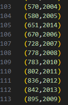
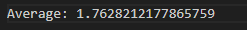
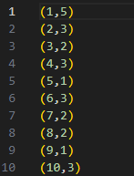
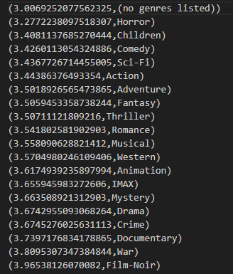
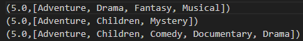
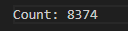
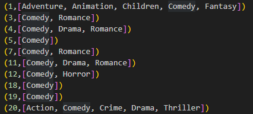
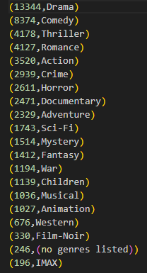
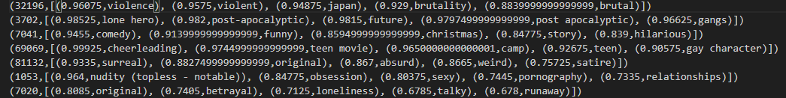
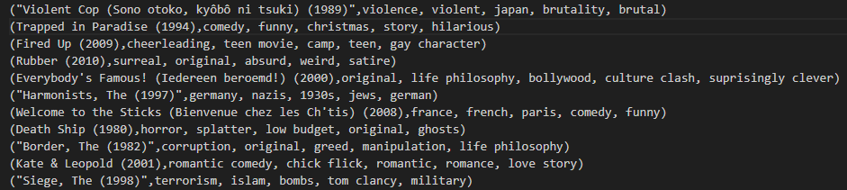

# Analysis of the MovieLens Dataset using Apache Spark
#### Ayush Adhikari
<hr>

This project was an introduction to using Apache Spark to analyze a large file (~800 MB), namely the Movie Lens dataset containing movies, genres, ratings, etc. The files were stored using HDFS and cluster size consisted of 10 machines. There is 1 Java file with 7 Spark jobs which are focused on answering the 7 questions below. Each question details the outputs and the explanation of the jobs.

### Q1. How many movies were released for every year within the dataset?
<div style="display:flex">
     
     <a href="./outputs/Q1/part-00000">Full Output</a>
</div>
For this question, I only used the movies file and set the key as the year and a 1 as the value. I then reduced the RDD by the key, which added the counts together. Finally, I sorted the keys and output the final result in a file.
<hr>

### Q2. What is the average number of genres for movies within this dataset?
<div style="display:flex">
    <div>
        <p>Average number of genres</p>
        
        <a href="./outputs/Q2/count.txt">Full Output</a>
    </div>
    <div>
        <p>All movies with a count of their genres</p>
        
        <a href="./outputs/Q2/part-00000">Full output of genre count for all movies</a>
    </div>
</div>
For this question, I set the movieID as the key and a count of how many genres defined that movie as the value. This way, I was able to get the values and calculate the average by dividing by the number of movies.
<hr>

### Q3. Rank the genres in the order of their ratings?
<div style="display:flex">
     
     <a href="./outputs/Q3/part-00000">Full Output</a>
</div>
For this question, I use two files, movies and ratings. I joined the files based on the movieID column and created an RDD with just the genre as the key and the rating as value using flatMapToPair. This allowed me to use groupByKey so I could get an iterable of all of the ratings for a particular genre, from which I can sum the ratings and divide by the count. This gave me the final result.
<hr>

### Q4. What are the top-3 combinations of genres that have the highest ratings?
<div style="display:flex">
     
     <a href="./outputs/Q4/part-00000">Full Output</a>
</div>
I also used movies and ratings for this and similarly joined the two files based on the movieID column. Instead of splitting the genres to their own rows, I filtered out all of the movies that had less than 2 genres and collected the ratings for each movie that passed. The final step was to set the rating as the key and a string representation of the genres as the value and then sort it based on the keys.
<hr>

### Q5. How many movies have been tagged as “comedy”
<div style="display:flex">
    <div>
        <p>Count of movies tagged as comedy</p>
        
        <a href="./outputs/Q5/count.txt">Full Output</a>
    </div>
    <div>
        <p>All movies that have the comedy genre</p>
        
        <a href="./outputs/Q5/part-00000">Full Output</a>
    </div>
</div>
For this question, I just used the movies file and split the file into id and genres. I used a filter and regex to match lowercase and uppercase "comedy" in the string of genres. After doing so, I counted the remaining entires and output that.
<hr>

### Q6. What are the different genres within this dataset? How many movies were released within different genres?
<div style="display:flex">
     
     <a href="./outputs/Q6/part-00000">Full Output</a>
</div>
This question was similar to Q3 in that I used a flatMapToPair to separate the genres with a count of one each and then reduced by the genre, which was the key to get a count of movies with that genre. I then sorted RDD and output that.
<hr>

### For every movie, what are the five most relevant tags. Display one with the relevancies and one with the movie name and just the top 5 genres.
<div style="display:flex">
    <div>
        <p>Movies with their five most relevant tags with the percentage</p>
        
        <a href="./outputs/Q7/finalOutput/part-00000">Full Output</a>
    </div>
    <div>
        <p>Movies with names and the top 5 most relevant tags without percentage</p>
        
        <a href="./outputs/Q7/top5GenomeTags/part-00000">Full Output</a>
    </div>
</div>
For this question, I wanted to explore the other datasets in the collection since we had not used them in the analysis. I chose to use the genome-tags and genome-scores files to get the list of all tags associated with a movie. I joined the genome files on tagID to get the name of the tag and then joined that to movies using movieID to get the name of the movie. After joining the two genome files, I set the value of the RDD as a tuple containing the tag name and the relevancy. I used groupByKey to group each movie with all of its tags and then used the stream API to sort the iterable by the value in the relevancy property. This allowed me to select the top 5 tags and output this in top5GenomeTags. I then collected only the tag names and the movie names into a separate file for the second part of the question.
<hr>

To start DFS:
```bash 
$ start-dfs.sh
```
To start master:
```bash
$ start-master.sh
```
To start workers:
```bash
$ start-workers.sh
```
To use the spark shell
```bash
$ spark-shell
```
To run the Java program using Gradle:
```bash
$ gradle run
```
